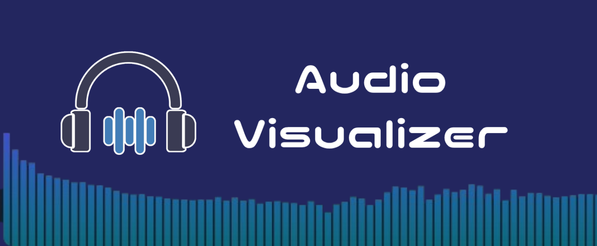
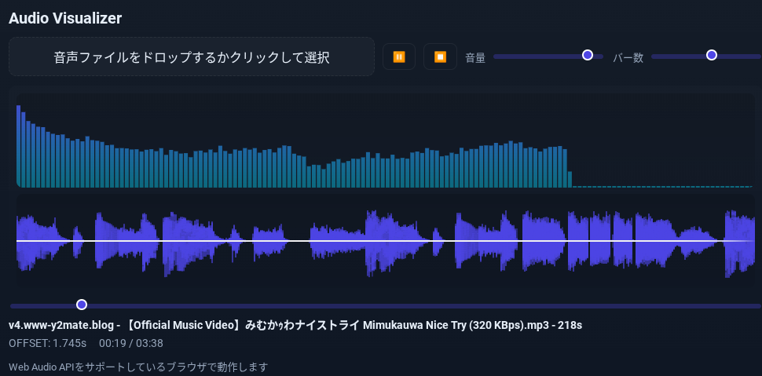

# Audio-Visualizer
  
ブラウザで動作するAudio Visualizerです。  
音声ファイルを選択して周波数スペクトラムと波形を視覚化します  
**サイトリンク**  
http://veda00133912.github.io/Audio-Visualizer  
## 機能
- リアルタイムに描画される周波数バーと波形  
- OFFSETの自動検出  
- 今後も追加予定...  

## 使い方
1. サイトにアクセス
2. 音声ファイルをアップロード
3. 再生ボタンを押す

## 注意事項
> [!WARNING]
> Web Audio API をサポートしているブラウザでのみ動作します  
> 大きな音声ファイルは読み込みに時間がかかる場合があります 